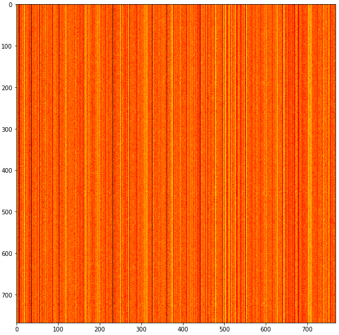
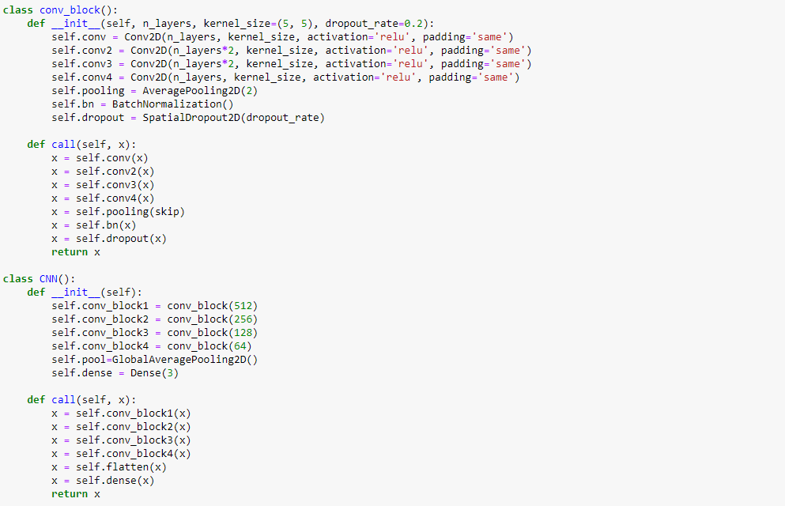

# Movie-predictions-CNN

## Description:

The hypothesis of this experiment is to what extent the semantics of a movie subtitle relates to the critique's score?
The hypothesis is tested by training a CNN model on the matrices (of the movie's subtitle's semantics) and evaluate its performance on the Rotten Tomatoes' tomatometer (Rotten,  Certified-Fresh or Fresh).

The csvs were note uploaded to the GitHub repo because the dimension of some files is too large.

link for subtitles and (imdb) meta data: https://www.kaggle.com/datasets/adiamaan/movie-subtitle-dataset?select=movies_meta.csv
link for rotten tomatoes data: https://www.kaggle.com/datasets/stefanoleone992/rotten-tomatoes-movies-and-critic-reviews-dataset

## Method:

### Step 1:

the imdb dataset and the rotten tomatoes dataset were combined, selecting only certain genres and certain years to reduce as much as possible external variables

### Step 2:

The subtitles of every movie was cleaned and normalized.

### Step 3: 

The semantics vectors for every chunk were retrieve of every movie with GPT-2

### Step 4: 
 
for every movie, a matrix containing the semantic vectors was created. example of matrix:

### Step 5

CNN was trained on the matrices to predict the tomatometer. The structure of the model is: 

